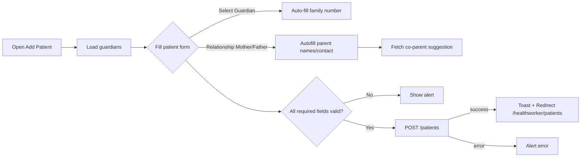
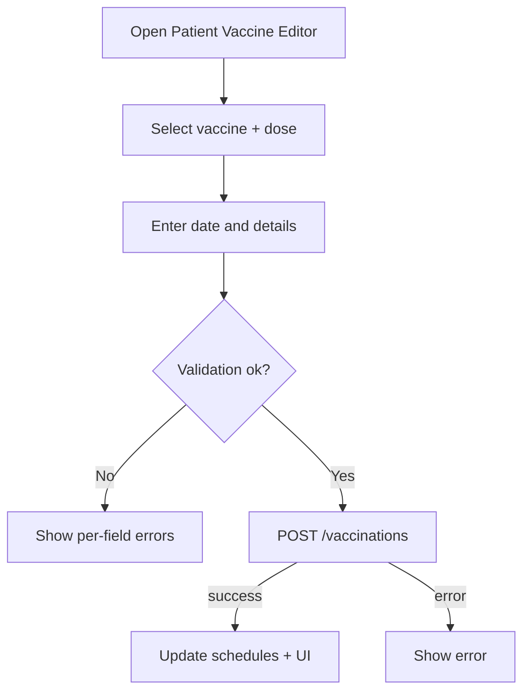
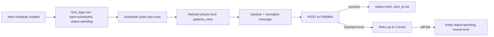
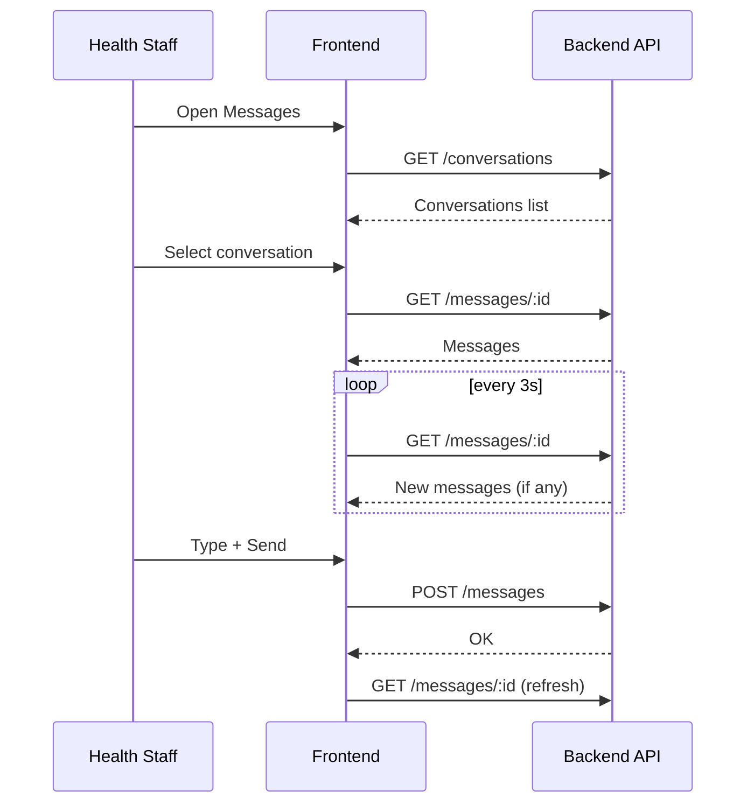

## ALWAYS UPDATE THIS, DO NOT DELETE!!! ##

# Systems and UI — Processes, Flows, Buttons, Modals, and Logic (Comprehensive)

Audience: developers, QA, and operators. This document explains how each major system works (backend + frontend), UI routes and components, user flows, button and modal behavior, and key business rules/validations.

Last updated: 2025-11-01 (branch: system-prototype-v2)

---

## 1) Core Systems Overview

This app is a role-based Immunization Management System for Admin, Health Staff, and Parent users.

Systems:
- Authentication and Roles (JWT-based)
- Patient and Guardian Management
- Vaccination Records and Scheduling
- Vaccine Inventory and Receiving Reports
- SMS Management (templates, manual send, scheduled reminders)
- Chat and Notifications
- Reports and Analytics
- Activity Logging
- QR Scan and Patient Routing

Key folders:
- Backend: `backend/` (Express + PostgreSQL via Supabase client)
- Frontend: `frontend/` (Vue 3 + Router + Bootstrap 5)
- Docs: `docs/` (full product/feature docs)

---

## 2) Authentication and Role Routing

Backend routes: `backend/routes/authRoutes.js`
- POST `/api/auth/login` — login with identifier (email/username/phone) + password.
- POST `/api/auth/register` — admin-assisted registration.
- POST `/api/auth/logout` — invalidate session.
- POST `/api/auth/change-password` — current user.
- Utility routes for mapping, refresh token, debug UUID.

Frontend route-guard: `frontend/src/router/index.js`
- `requiresAuth` meta protects routes.
- Role normalization: accepts `admin`, `healthstaff` (legacy aliases like `healthworker`, `health_staff` are mapped), and `parent` (guardian normalized to parent).
- On mismatch, redirects to role dashboard:
  - Admin → `/admin/dashboard`
  - Health Staff → `/healthworker/dashboard`
  - Parent → `/parent/home`

Mermaid — Login and route guard
```mermaid
flowchart TD
  A[Login form] -->|POST /api/auth/login| B{Auth success?}
  B -- No --> C[Show error]
  B -- Yes --> D[Store token]
  D --> E[Read role]
  E -->|admin| F[/admin/dashboard]
  E -->|healthstaff| G[/healthworker/dashboard]
  E -->|parent| H[/parent/home]
```

Approval modal (extra-check): `frontend/src/components/ApprovalModal.vue`
- Used when an action requires a 2nd user’s approval.
- Constraints:
  - Approver cannot be the current user.
  - Approver cannot be a guardian.
  - Approver cannot be BHS staff (`hs_type` contains `bhs`).
- Performs a one-off `/api/auth/login` call (no token stored) to verify.

---

## 3) Patient and Guardian Management

Representative UI (folder name may be legacy): `frontend/src/views/healthworker/AddPatient.vue`
- Sections: Patient Information, Guardian & Family, Birth History.
- Required fields validation with alerts for missing required inputs.
- Guardian selection auto-fills family number and can auto-fill mother/father details depending on relationship.
- Parent suggestions: calls
  - `GET /patients/parents/suggestions?type=mother|father`
  - `GET /patients/parents/coparent?type=mother|father&name=...`
- Submit: `POST /patients` with a normalized payload; converts date inputs to ISO (yyyy-mm-dd) when necessary.
- Navigation: Back button confirms if user wants to discard.

Mermaid — Add patient (Health Staff)


Buttons/behaviors:
- Save Record — disabled while submitting; shows spinner.
- Back — confirmation dialog to prevent data loss.
- Dropdowns with live filtering for parent suggestions; click item inserts and may auto-fill contact/occupation.

Parent & Guardian data sources:
- Guardians list: `GET /guardians`
- Suggestions: `/patients/parents/suggestions`, `/patients/parents/coparent`

---

## 4) Vaccination Records and Scheduling

-Representative UIs (examples):
- Health Staff: `AddPatientImmunizationRecord.vue`, `EditVaccinationRecord.vue`, `VaccineRecordDetails.vue`
- Admin analogs under `/views/admin/patients/…`

Common features:
- Add/edit vaccination record for a patient (dose, date, vaccine type).
- Display scheduled and completed vaccinations.
- Rescheduling logic (see `docs/SMS_RESCHEDULE_FIX.md` for SMS-related implications).
- Approvals: sensitive edits can require `ApprovalModal` (config by feature if needed).

Typical validation rules:
- Dose numbers must be sequential and valid per vaccine schedule.
- Dates cannot be in the future (config-dependent).
- Required fields: vaccine, dose, administered_by or facility, etc.

Mermaid — Add vaccination


---

## 5) Vaccine Inventory and Receiving Reports

Representative UIs:
- Admin inventory suite under `/admin/inventory` and `/admin/vaccines/*` routes
  - Add/Edit Stock, Adjustments, Receiving Reports, Vaccine Types, Schedules

High-level behaviors:
- Track `vaccine_types`, `vaccine_stock`, lot numbers, and expiry.
- Receiving reports create auditable stock entries.
- Adjustments record +/- corrections with reason.

Buttons/Modals:
- Save/Update forms.
- Transaction history viewers.
- Confirmations for destructive edits.

---

## 6) SMS Management (Templates, Logs, Manual + Scheduled)

Key components:
- `frontend/src/features/admin/sms/components/MessageTemplates.vue`
  - Buttons: Refresh, Create Template, View, Edit, Duplicate, Delete, Toggle Active.
  - Editor Modal: Name, Trigger Type (`1-week`, `3-days`, `1-day`, `0-day`, `manual`), Time Range (`day`/`evening`), Template text, Active switch, Preview.
- `frontend/src/features/admin/sms/components/MessageLogs.vue`
  - Filters: status, type, date, search; sorting and pagination.
  - Buttons: Refresh, Manual (open send modal), View message (details modal).
  - Manual SMS Modal: Use Template switch; Preview; Send Now.

Backend service logic: `backend/services/smsService.js`
- `formatPhoneNumber()` normalizes Philippine numbers to +63 format.
- `sanitizeMessage()` trims whitespace lines, keeps meaningful newlines, inserts spacing around sections and signatures.
- `normalizeForTelco()` reduces Unicode punctuation to ASCII and ensures GSM-7 friendliness.
- `sendSMS()` posts to PhilSMS API with retries handled by scheduler when transient failures.
- `replaceTemplateVariables()` performs variable replacement including `{greeting_time}`, `{guardian_title}`, `{guardian_last_name}`, `{patient_name}`, `{vaccine_name}`, `{dose_number}`, `{scheduled_date}`, `{vaccine_lines}`, etc.

Scheduler: `backend/services/smsScheduler.js`
- Mode: interval (default, `SMS_CRON_MODE=interval`) or daily (`SMS_CRON_MODE=daily`).
- Picks due `sms_logs` with `status in ('pending','scheduled')` & `type='scheduled'` and `scheduled_at <= now`.
- Refreshes recipient phone from `patients_view` when available to avoid stale numbers.
- Sends via `smsService.sendSMS()`; retries on transient errors (timeout/502–504/gateway issues) with backoff.
- Updates `sms_logs.status` to `sent` (or leaves `pending` with `error_message` for retry).
- Activity logs emitted for success/failure.

Mermaid — Scheduled SMS flow


Template variables (UI + backend): see `docs/SMS_TEMPLATE_SPECS.md` for authoritative list and formatting rules.

---

## 7) Chat and Notifications

Chat UI (Health Staff): `frontend/src/views/healthworker/Messages.vue`
- Two views: conversations list and chat view.
- Polling every 3s when a conversation is open.
- Buttons:
  - New (opens modal): pick recipient, optional subject and first message → Create conversation → Open.
  - Send (in chat composer): disabled until there’s text.
  - Back buttons to return to conversations.
- Modals:
  - New Conversation modal with recipient dropdown.

Shared chat logic: `frontend/src/features/shared/chat/useChatService.js`
- Normalizes user IDs and conversation titles.
- API endpoints (typical):
  - `GET /conversations`, `GET /messages/:conversationId`, `POST /messages`, `POST /conversations/start`.

Notifications (Health Staff): documented in `docs/HEALTH_WORKER_FEATURES_QUICK_GUIDE.md`
- Filters: All / Unread / Read; quick actions (Refresh, Mark All Read, Clear Read).
- Clicking a notification marks it read and can navigate to a target page (e.g., chat).
- Auto-refresh every 30s.

Mermaid — Chat flow


---

## 8) Reports and Analytics

Admin routes: `/admin/reports` and related.
- Monthly Immunization Report page may show placeholder/sample while backend is refined (see note in `docs/README.md`).
- Analytics widgets (e.g., `BarChart.vue`).
- Activity Logs under `/admin/activity` with details page.

---

## 9) Activity Logging

Back-end model: `backend/models/activityLogger.js` (emitted from key flows like scheduler sends).
- Stores who did what (or system), entity type/id, and serialized before/after in some cases.
- Used for audit and dashboards.

---

## 10) QR Scanner and Patient Routing

Routes:
- Health Staff QR page: `/healthworker/qr` (scanner UI).
- Neutral patient route: `/patient/:id` → `PatientRoute.vue` (redirects to role-appropriate patient details page).

Expected flow:
1) HW scans QR → patient ID.
2) Navigate to `/patient/:id`.
3) Router guard ensures auth; `PatientRoute` decides where to redirect based on role:
   - Admin → `/admin/patients/view/:id`
  - Health Staff → `/healthworker/patients/:id`
   - Parent → `/parent/records/:id`

---

## 11) Full UI Route Map (by Role)

Defined in `frontend/src/router/index.js`.

- Admin:
  - Dashboard, Patients (add/edit/view and visit/vaccination editors), Inventory suite, SMS (logs/management), Reports, Users, Activity Logs, Profile, Settings, FAQs, Notifications Inbox, Chat.
- Health Staff:
  - Dashboard, Patients (list/detail), Add Patient, Immunization add/edit, Vaccine details, Stock, Notifications, Messages, Profile, Settings, QR Scanner.
- Parent:
  - Home (dashboard), Records + details, Vaccine details, Visit summary, Schedule, Profile, Notifications, Messages.

---

## 12) Buttons and Modals—Catalogue and Behavior

Global/system modals and key buttons:

- ApprovalModal (`frontend/src/components/ApprovalModal.vue`)
  - Buttons: Confirm (validates approver via `/api/auth/login`), Cancel.
  - Errors for invalid roles or same-user approval.

- SMS Templates (`MessageTemplates.vue`)
  - Buttons: Refresh, Create Template, View, Edit, Duplicate, Delete, Toggle Active, Save Template.
  - Modals: Template Editor (create/edit), Template Viewer.

- SMS Logs (`MessageLogs.vue`)
  - Buttons: Refresh, Manual (open modal), View message in details modal.
  - Modals: Message Details, Manual SMS (with Use Template toggle, Preview, Send Now).

- Health Staff Messages (`views/healthworker/Messages.vue`)
  - Buttons: Back, New (open modal), Send.
  - Modal: New Conversation (recipient, optional subject/message).

- Add Patient (`views/healthworker/AddPatient.vue`)
  - Buttons: Save Record, Back (with confirm).
  - Inline dropdown menus for parent suggestions; auto-fill behavior on selection.

- Inventory views
  - Buttons: Save/Update/Adjust; destructive actions ask for confirmation.

---

## 13) Business Logic & Validation Rules (highlights)

- Auth: identifier can be username/email/phone; phone accepts `09XXXXXXXXX` or `+639XXXXXXXXX`.
- Roles: router normalizes role aliases; guardian treated as parent for routing.
- Add Patient:
  - Required fields marked with `*` must be present; alerts on missing.
  - Relationship to guardian can auto-fill mother/father fields.
  - Birth history fields (time, attendant, delivery type) are required.
- Vaccination:
  - Validate dose numbers and schedule constraints.
  - Disallow invalid future dates (config; adjust as needed).
- SMS:
  - Phone normalized to +63 with `formatPhoneNumber()`.
  - Message sanitation preserves meaningful line breaks, inserts spacing around section headers and signatures.
  - Normalization reduces Unicode punctuation to ASCII for GSM interoperability.
  - Scheduler retries transient failures with exponential backoff; updates `sms_logs` accordingly.
  - Template variables replaced consistently in backend; UI previews mimic replacements.
- Chat:
  - Titles derived from participant list excluding current user; supports 1:1 and group conversations.
  - Polling on active conversation every 3 seconds.
- Approvals:
  - For actions requiring dual control, approver must be different from actor, not guardian, not BHS.

---

## 14) Edge Cases & UX Notes

- Network errors: show alert/toast; preserve form data when possible.
- Long SMS: UI displays character counts; backend may send multi-part (provider dependent).
- Time zones: SMS logs display shifted to PH time in UI; scheduler uses `Asia/Manila` by default.
- Phone numbers: user input cleaned; last-resort `+63` prefix if digits look incomplete but >= 11.
- Chat recipients: `GET /api/users` normalizes `id` to `user_id` for stable dropdown binding.
- Patient QR flow: ensure authenticated role; otherwise redirect to login and then to correct details page.

---

## 15) Reference APIs (selected)

- Auth: `/api/auth/*` (login, change-password, mapping, refresh-token)
- Patients: `/api/patients/*` (list, create, update, visits, vaccinations)
- Vaccinations: `/api/vaccinations/*` (record, update, scheduled)
- Inventory: `/api/inventory/*` (types, stock, receiving)
- SMS: `/api/sms`, `/api/sms/history`, `/api/sms/templates`, `/api/sms/templates/preview`, `/api/sms/guardians`
- Chat: `/api/conversations`, `/api/messages`, `/api/conversations/start`
- Reports: `/api/reports/*`

See `docs/README.md` and topic-specific docs under `docs/` for deeper details:
- SMS system: `docs/SMS_SYSTEM_COMPLETE.md`, `docs/SMS_TEMPLATE_SPECS.md`, `docs/SMS_MANAGEMENT_README.md`, `docs/SMS_TESTING_PLAN.md`
- Health staff UX: `docs/HEALTH_WORKER_FEATURES_QUICK_GUIDE.md`, `docs/HEALTH_WORKER_ARCHITECTURE.md`

---

## 16) Try-it Checklists (QA-focused)

- Login redirect by role works; unauthorized routes redirect to proper dashboard.
- Add Patient: required validations trigger; parent auto-fill works; co-parent suggestion works; successful POST navigates to list.
- Vaccination editor: can add/edit records; invalid inputs blocked; confirmation/approval where required.
- Inventory: create/edit vaccine types; receiving reports recorded; low stock flags where applicable.
- SMS Templates: create/edit/activate; preview renders variables; duplicate/delete works.
- SMS Manual: phone normalization; template preview and send; logs update; view message modal shows details.
- Scheduler (dev): set due `scheduled_at` and watch transition to `sent`; check retry on simulated failure.
- Chat: new conversation creation; polling shows new messages; send button state respects empty content; titles render names.
- Notifications: filters and mark-as-read; click-through to chat if applicable; auto-refresh.
- QR: scanning navigates to `/patient/:id` and reroutes based on role.

---

## 17) Appendix — Glossary of Buttons and Modals

Buttons (non-exhaustive):
- Save, Update, Adjust, Delete, Refresh, Send, Preview, Create Template, Duplicate, Activate/Deactivate (toggle), New (conversation), Back, Cancel, Confirm.

Modals:
- ApprovalModal — second-user validation for sensitive actions.
- Template Editor / Template Viewer — create/edit/view SMS templates.
- Message Details — inspect a single SMS log entry.
- Manual SMS — compose or template-based manual message.
- New Conversation — pick recipient and optionally subject/message.

States/Indicators:
- Disabled buttons during async (e.g., Saving…, Sending…).
- Badges: unread counts, SMS status/type chips.
- Spinners for loading lists and messages.

---

This document is meant to be living. If you add or change UI elements, flows, or backend logic, please update the relevant section and link the component or API involved.
